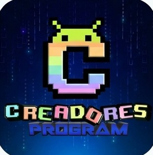

# CreaProFDR Repo 🚀

Repositorio personalizado de **F-Droid** enfocado en brindar apps/juegos útiles tanto para versiones legacy como modernas.

Link oficial del repositorio:

'https://creadores-program.github.io/CreaProFDR/repo'

---

## 📱 ¿Cómo añadir este repositorio a tu F-Droid?
1. Instala una versión compatible de F-Droid en tu dispositivo.
2. Abre la aplicación de F-Droid y ve a **Ajustes** > **Repositorios**.
3. Toca en el icono de agregar (**+**) y pega la URL del repo con fingerprint en
   'https://creadores-program.github.io/CreaProFDR/repo' (o escanear el QR del mismo)
4. Guarda y actualiza los repositorios. ¡Listo!
---
## 📦 Aplicaciones Destacadas

| Aplicación | Descripción | Compatibilidad |
| :--- | :--- | :--- |
| **CreaTV** | Reproductor de streams para Twitch, Kick, TikTok Live y YouTube Live. | Android 2.3 a 10 |
| **CreaProDroid** | Asistente de Inteligencia Artificial ligero para dispositivos Android. | Android 4.0 a 9.0 |
| **LegacySend** *(Fork)* | Alternativa tipo AirDrop de código abierto basada en el protocolo LocalSend (totalmente compatible). | Varias versiones |
| **RetroCreaBrowser** | Navegador parcheado para modernizar la navegación web en sistemas antiguos. | Android 2.1 a 7.1 |

> 🔮 **Próximamente:** Más aplicaciones y juegos en desarrollo. Algunos estarán enfocados exclusivamente en Android moderno y otros para todas las versiones.
---
## ⚙️ Compatibilidad y Clientes F-Droid para Android Antiguo
Si estás intentando acceder desde un dispositivo muy antiguo, las versiones modernas de F-Droid no se instalarán. Te recomendamos usar estas alternativas:
* **Android 4.4+:** Puedes utilizar **F-Droid Classic**, un cliente más liviano y adaptado para versiones intermedias.  
  👉 [Descargar F-Droid Classic](https://f-droid.org/es/packages/eu.bubu1.fdroidclassic/)
* **Android 2.0+ (e incluso 1.5+):** Consulta la guía oficial de F-Droid para instalar clientes legados y configurar certificados antiguos.  
  👉 [Guía de F-Droid para Android antiguo](https://f-droid.org/es/docs/Running_on_old_Android_versions/)
---
## 🤝 Créditos y Proyectos Base
* **LocalSend / LegacySend:** Basado en el protocolo open-source de [LocalSend](https://localsend.org/).
* Proyecto administrado por [Creadores Program](https://github.com/Creadores-Program).
